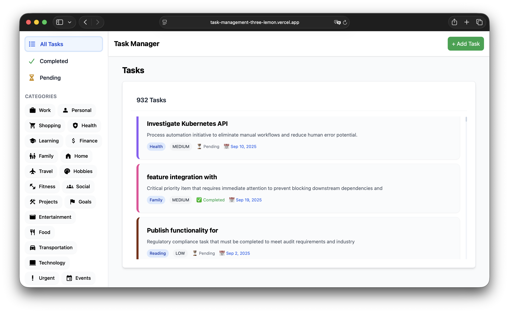
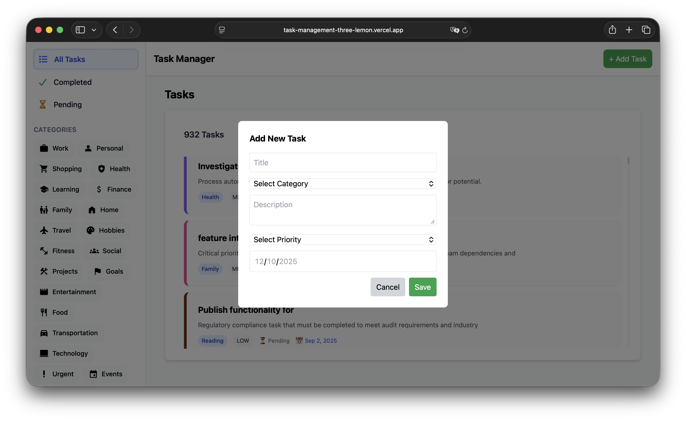
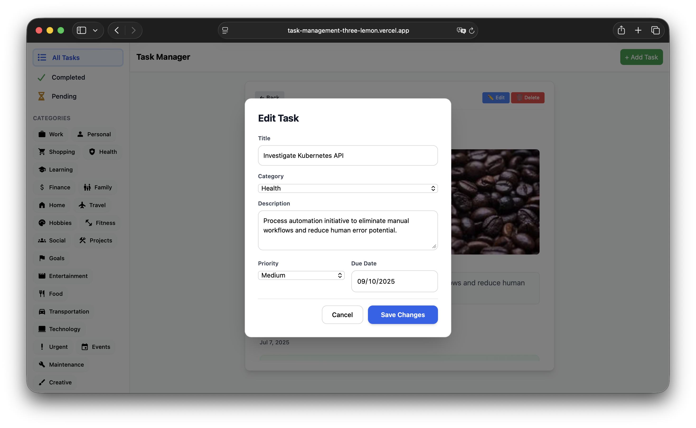
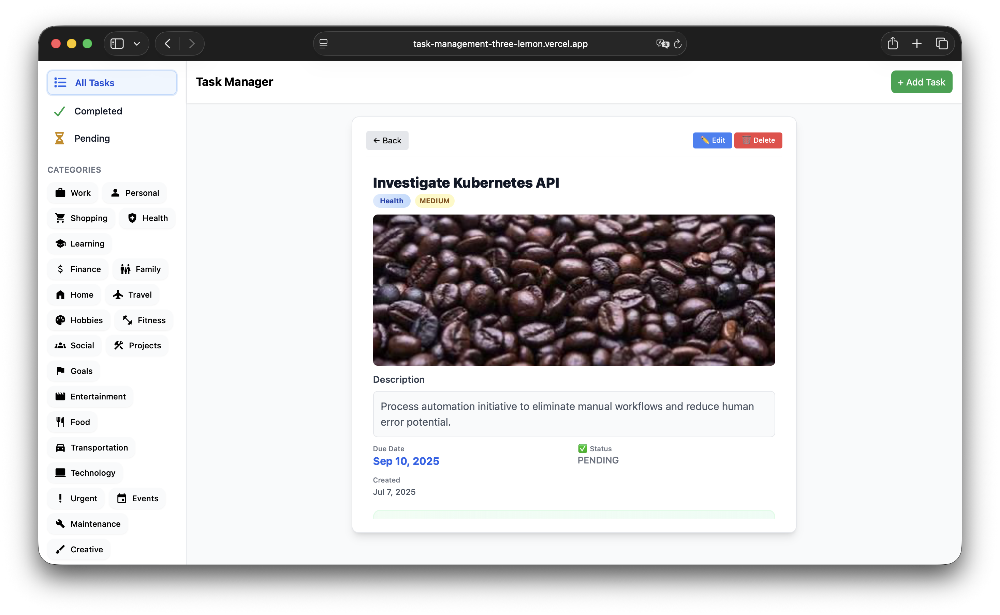
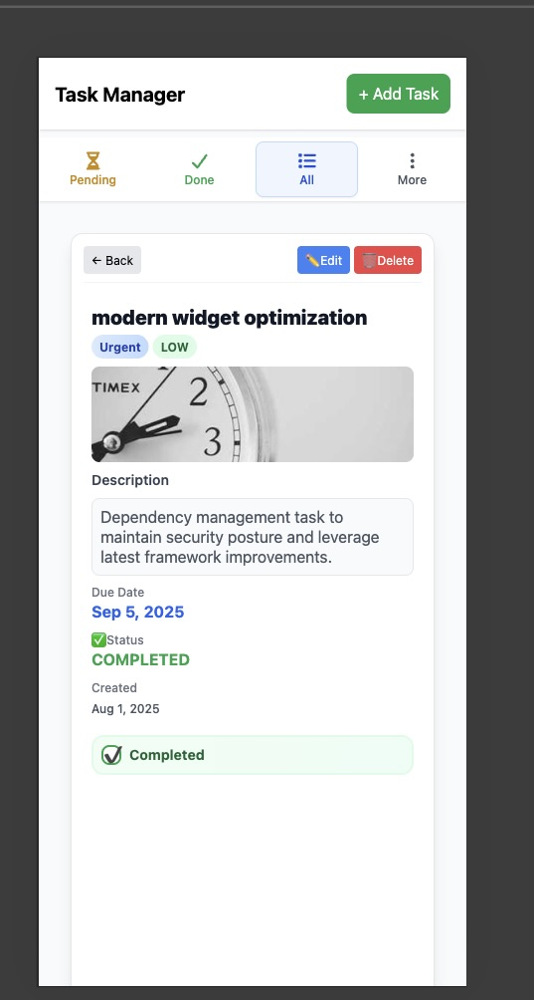
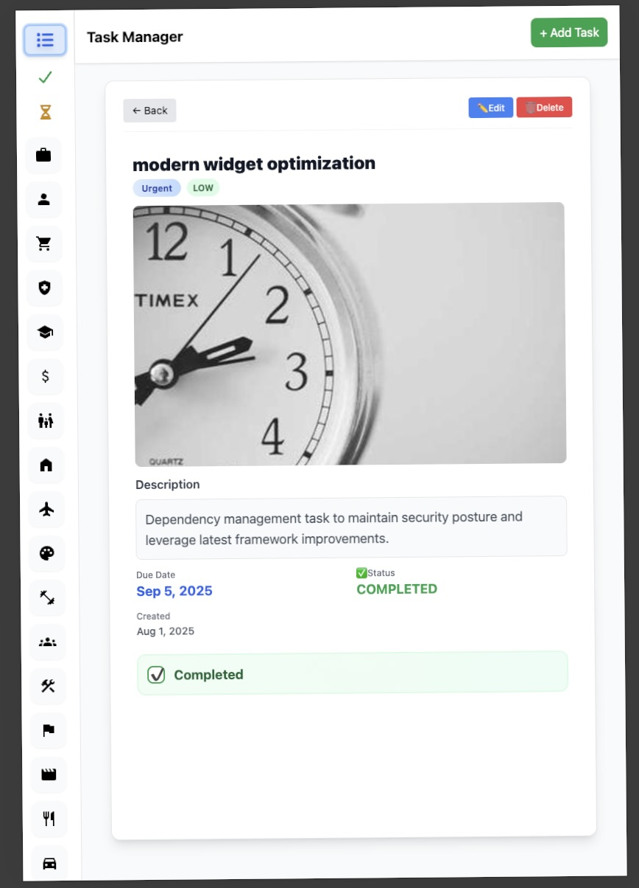

# Task Management App

A simple task manager web application built with **Vue.js**, using **Pinia** for state management, and styled with **Tailwind CSS**. This project connects to a **Supabase REST API** for task and category management.

---

## Table of Contents

- [Demo](#demo)
- [Setup & Run Instructions](#setup--run-instructions)
- [State Management](#state-management)
- [Component Architecture](#component-architecture)
- [Features Implemented](#features-implemented)
- [Known Limitations](#known-limitations)
- [Screenshots](#screenshots)

---

## Demo

Check the live demo here: [task-management-three-lemon.vercel.app]

---

## Setup & Run Instructions

1. **Clone the repository**

```bash
git clone https://github.com/Ahmed-Wageh7/Task-Management.git
cd Task-Management
```

## State Management

This project uses **Pinia** to manage the application's state:

- Tasks and categories are stored in Pinia stores.
- Components subscribe to the store to get reactive data.
- Actions in the store handle API calls to fetch, create, update, and delete tasks.

## Component Architecture

The project follows a component-based architecture using Vue.js. Key components:

- **App.vue**: Root component that sets up the main layout.
- **Navbar.vue**: Top navigation bar for the application.
- **Sidebar.vue**: Sidebar for category navigation and filtering.
- **TaskList.vue**: Displays a list of tasks with cards and filtering options.
- **Spinner.vue**: Loading spinner component used for API call states.
- **Views/Home.vue**: Main page that integrates the sidebar and task list.
- **Router**: Manages navigation between views.
- **Stores**: Pinia stores handle tasks and categories state.

## Features Implemented

This task management app includes the following core features:

### Task List View

- Display tasks in cards/list with title, description, category, and completion status.
- Show task images with proper loading and fallback.
- Filter tasks by category.
- Loading states while fetching data from API.
- Add Task button for quick task creation.

### Add/Edit Task Form

- Required fields: Title and Category.
- Optional fields: Description, Priority, Due Date.
- Form validation with error messages.
- Save and Cancel functionality.
- Loading state during task submission.

### Task Detail View

- Display full task information.
- Toggle task completion status.
- Edit and Delete actions.
- Navigate back to the task list.

### Category Integration

- Fetch and display categories from Supabase API.
- Display category colors and icons for visual distinction.

### Extras / Additional Improvements

- Responsive design for desktop, tablet, and mobile screens.
- Smooth transitions between different views for better UX.
- Loading skeletons and error handling for API calls.
- Confirmation dialog before deleting tasks.
- Keyboard navigation support for task management.

## Known Limitations

- No user authentication implemented (all tasks are public).
- Pagination is not implemented; all tasks are loaded at once, which may affect performance for large datasets.
- Offline mode is not supported; the app requires an internet connection.
- No unit or integration tests added.

## Screenshots

### Home Page




### Add Task Form



### Add edit Form



### Task Detail View



### mobile View



### Tablet View


